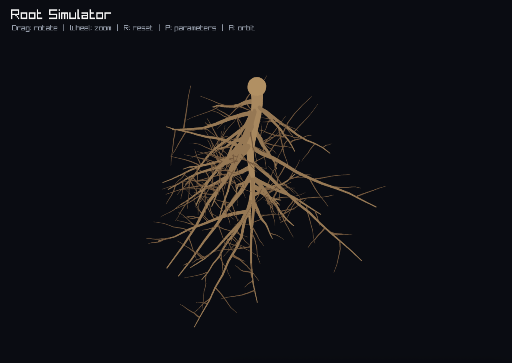

# Root Simulator

**Live project:** [https://jacobcohn.github.io/root-simulator/](https://jacobcohn.github.io/root-simulator/)

Root Simulator is an interactive artwork made for the class assignment **“Making it Visible.”** The assignment asks students to create an artwork or experience that reveals plant roots: a hidden plant part that is usually underground, unseen, and outside of everyday attention.

This project makes an imagined root system visible. A viewer can rotate around the roots, open a parameter panel, change how the roots grow, and generate new forms. The piece is not meant to be an exact scientific simulation of one plant species. Instead, it uses procedural growth as an artistic way to show roots as active, complex, and variable structures.

Built with C++, raylib, WebAssembly, and GitHub Pages.

## Class context

The assignment prompt asks:

> “An artwork, as a part, can point a viewer’s or participant’s imagination towards what isn’t explicitly shown, but must certainly be there. What are the active connections and important details teeming just out of view?”  
> — Andrew S. Yang, *Aesthetics of Hidden Ecologies*

Root Simulator responds to this prompt by revealing an underground form that is normally hidden. The visible root system is shaped by invisible rules: length, branching, angle, and randomness. These controls suggest the unseen conditions that affect real roots, such as soil, gravity, water, nutrients, obstacles, and chance.

## Concept

Roots support the visible plant world, but they are usually concealed. This piece treats roots as an unseen architecture: branching, searching, adapting, and spreading beneath the surface.

The viewer can adjust different orders of roots:

- **Primary roots**
- **Laterals**
- **Fine roots**

Each generated root system is different. By changing the parameters, the viewer can see how small invisible rules create larger visible forms. The work asks the viewer to consider the plant body below ground as something active and expressive, not just hidden support.

## Interaction

The viewer can:

- Rotate around the root system
- Zoom in and out
- Open a parameter panel
- Change root length, branch amount, angle, and randomness
- Generate a new root system
- Toggle automatic orbiting

The interaction is meant to make the hidden system feel explorable. Instead of looking at a single fixed drawing of roots, the viewer can participate in revealing many possible underground structures.

## Artist statement

Root Simulator makes plant roots visible by turning hidden growth rules into an interactive visual form. The piece focuses on what is usually out of sight: the branching underground structure that allows visible plant life to exist. By letting the viewer alter the root system and generate new forms, the work points toward the complexity of hidden ecologies and the relationships between what is seen above ground and what must be present below it.

## Deployment

For deployment and build instructions, see [`DEPLOYMENT.md`](DEPLOYMENT.md).
